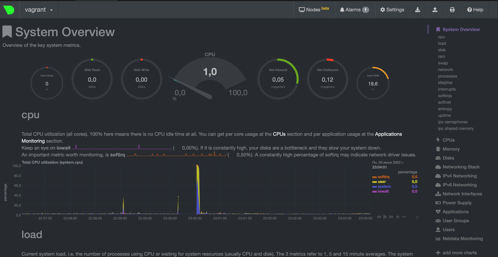

# Домашнее задание к занятию "3.4. Операционные системы, лекция 2"

1. На лекции мы познакомились с [node_exporter](https://github.com/prometheus/node_exporter/releases). В демонстрации его исполняемый файл запускался в background. Этого достаточно для демо, но не для настоящей production-системы, где процессы должны находиться под внешним управлением. Используя знания из лекции по systemd, создайте самостоятельно простой [unit-файл](https://www.freedesktop.org/software/systemd/man/systemd.service.html) для node_exporter:

    * поместите его в автозагрузку,
    * предусмотрите возможность добавления опций к запускаемому процессу через внешний файл (посмотрите, например, на `systemctl cat cron`),
    * удостоверьтесь, что с помощью systemctl процесс корректно стартует, завершается, а после перезагрузки автоматически поднимается.

    **Ответ:**

    Состав unit-файла для node_exporter:

    ```bash
    # /etc/systemd/system/node_exporter.service
    [Unit]
    Description=Node Exporter
    Wants=network-online.target
    After=network-online.target
    
    [Service]
    User=node_exporter
    Group=node_exporter
    Type=simple
    EnviromentFile=-etc/default/node_exporter
    ExecStart=/usr/local/bin/node_exporter $VAR
    
    [Install]
    WantedBy=multi-user.target
    ```

    Статус и активный режим автозапуска:

    ```bash
    vagrant@vagrant:/$ systemctl status node_exporter
    ● node_exporter.service - Node Exporter
         Loaded: loaded (/etc/systemd/system/node_exporter.service; enabled; vendor preset: enabled)
         Active: active (running) since Fri 2022-06-17 19:54:51 UTC; 1 day 23h ago
       Main PID: 13574 (node_exporter)
          Tasks: 6 (limit: 1112)
         Memory: 5.0M
         CGroup: /system.slice/node_exporter.service
                 └─13574 /usr/local/bin/node_exporter
    
    ```

    Переменные могут быть подгружены из внешнего файла etc/default/node_exporter. После перезагрузок и перезапусков все прекрасно работает. Вывод метрик:

    ```bash
    vagrant@vagrant:/usr/local/bin$ curl http://localhost:9100/metrics
    # HELP go_gc_duration_seconds A summary of the pause duration of garbage collection cycles.
    # TYPE go_gc_duration_seconds summary
    go_gc_duration_seconds{quantile="0"} 3.3931e-05
    go_gc_duration_seconds{quantile="0.25"} 4.1055e-05
    go_gc_duration_seconds{quantile="0.5"} 4.3147e-05
    go_gc_duration_seconds{quantile="0.75"} 4.9455e-05
    go_gc_duration_seconds{quantile="1"} 0.000336408
    go_gc_duration_seconds_sum 0.006188358
    go_gc_duration_seconds_count 123
    # HELP go_goroutines Number of goroutines that currently exist.
    # TYPE go_goroutines gauge
    go_goroutines 8
    # HELP go_info Information about the Go environment.
    # TYPE go_info gauge
    go_info{version="go1.17.3"} 1
    # HELP go_memstats_alloc_bytes Number of bytes allocated and still in use.
    # TYPE go_memstats_alloc_bytes gauge
    go_memstats_alloc_bytes 719352
    # HELP go_memstats_alloc_bytes_total Total number of bytes allocated, eve
    ```

2. Ознакомьтесь с опциями node_exporter и выводом `/metrics` по-умолчанию. Приведите несколько опций, которые вы бы выбрали для базового мониторинга хоста по CPU, памяти, диску и сети.

    **Ответ:**

    CPU

    ```bash
    # HELP node_cpu_guest_seconds_total Seconds the CPUs spent in guests (VMs) for each mode.
    # TYPE node_cpu_guest_seconds_total counter
    node_cpu_guest_seconds_total{cpu="0",mode="nice"} 0
    node_cpu_guest_seconds_total{cpu="0",mode="user"} 0
    node_cpu_guest_seconds_total{cpu="1",mode="nice"} 0
    node_cpu_guest_seconds_total{cpu="1",mode="user"} 0
    
    ```

    Память

    ```bash
    # HELP node_memory_Cached_bytes Memory information field Cached_bytes.
    # TYPE node_memory_Cached_bytes gauge
    node_memory_Cached_bytes 5.44944128e+08
    # HELP node_pressure_memory_waiting_seconds_total Total time in seconds that processes have waited for memory
    # TYPE node_pressure_memory_waiting_seconds_total counter
    node_pressure_memory_waiting_seconds_total 0.132291
    
    ```

    Диск

    ```bash
    # HELP node_disk_written_bytes_total The total number of bytes written successfully.
    # TYPE node_disk_written_bytes_total counter
    node_disk_written_bytes_total{device="dm-0"} 7.45467904e+08
    node_disk_written_bytes_total{device="sda"} 7.86419712e+08
    # HELP node_disk_write_time_seconds_total This is the total number of seconds spent by all writes.
    # TYPE node_disk_write_time_seconds_total counter
    node_disk_write_time_seconds_total{device="dm-0"} 23.252
    node_disk_write_time_seconds_total{device="sda"} 15.151
    # HELP node_disk_reads_completed_total The total number of reads completed successfully.
    # TYPE node_disk_reads_completed_total counter
    node_disk_reads_completed_total{device="dm-0"} 18423
    node_disk_reads_completed_total{device="sda"} 14925
    # HELP node_disk_read_time_seconds_total The total number of seconds spent by all reads.
    # TYPE node_disk_read_time_seconds_total counter
    node_disk_read_time_seconds_total{device="dm-0"} 13.052
    node_disk_read_time_seconds_total{device="sda"} 8.96
    
    ```

    Сеть

    ```bash
    # HELP node_network_receive_bytes_total Network device statistic receive_bytes.
    # TYPE node_network_receive_bytes_total counter
    node_network_receive_bytes_total{device="eth0"} 4.8609417e+07
    node_network_receive_bytes_total{device="lo"} 480616
    # HELP node_network_receive_packets_total Network device statistic receive_packets.
    # TYPE node_network_receive_packets_total counter
    node_network_receive_packets_total{device="eth0"} 92330
    node_network_receive_packets_total{device="lo"} 2105
    # HELP node_network_transmit_bytes_total Network device statistic transmit_bytes.
    # TYPE node_network_transmit_bytes_total counter
    node_network_transmit_bytes_total{device="eth0"} 5.391631e+06
    node_network_transmit_bytes_total{device="lo"} 480616
    # HELP node_network_transmit_packets_total Network device statistic transmit_packets.
    # TYPE node_network_transmit_packets_total counter
    node_network_transmit_packets_total{device="eth0"} 65816
    node_network_transmit_packets_total{device="lo"} 2105
    
    ```

    

3. Установите в свою виртуальную машину [Netdata](https://github.com/netdata/netdata). Воспользуйтесь [готовыми пакетами](https://packagecloud.io/netdata/netdata/install) для установки (`sudo apt install -y netdata`). После успешной установки:
    * в конфигурационном файле `/etc/netdata/netdata.conf` в секции [web] замените значение с localhost на `bind to = 0.0.0.0`,
    * добавьте в Vagrantfile проброс порта Netdata на свой локальный компьютер и сделайте `vagrant reload`:

    ```bash
    config.vm.network "forwarded_port", guest: 19999, host: 19999
    ```

    После успешной перезагрузки в браузере *на своем ПК* (не в виртуальной машине) вы должны суметь зайти на `localhost:19999`. Ознакомьтесь с метриками, которые по умолчанию собираются Netdata и с комментариями, которые даны к этим метрикам.

    **Ответ:**

    

4. Можно ли по выводу `dmesg` понять, осознает ли ОС, что загружена не на настоящем оборудовании, а на системе виртуализации?

    **Ответ:**

    Можно. Даже можно понять, что это виртуализация oracle:

    ```bash
    vagrant@vagrant:~$ dmesg | grep virt
    [    0.003433] CPU MTRRs all blank - virtualized system.
    [    0.168509] Booting paravirtualized kernel on KVM
    [    4.842863] systemd[1]: Detected virtualization oracle.
    ```

    

5. Как настроен sysctl `fs.nr_open` на системе по-умолчанию? Узнайте, что означает этот параметр. Какой другой существующий лимит не позволит достичь такого числа (`ulimit --help`)?

   **Ответ:**

   ```bash
   vagrant@vagrant:~$ sudo sysctl --all | grep fs.nr_open
   fs.nr_open = 1048576
   ```

   Данный параметр означает:

   ```bash
   /proc/sys/fs/nr_open (since Linux 2.6.25)
   This file imposes ceiling on the value to which the RLIMIT_NOFILE resource limit can be raised (see getrlimit(2)).  This ceiling is enforced for both unprivileged and privileged process.  The default  value  in  this  file  is  1048576.   (Before  Linux  2.6.25,  the  ceiling  for RLIMIT_NOFILE was hard-coded to the same value.)
   ```

   Т.е. максимальное количество открытых файловых дескрипторов. Этот параметр можно увеличить командой:

   ```bash
   ulimit -Sn лимит, который может быть увеличен
   ulimit -Hn лимит, который может быть только уменьшен
   оба этих лимита не могут быть больше nr_open
   ```

6. Запустите любой долгоживущий процесс (не `ls`, который отработает мгновенно, а, например, `sleep 1h`) в отдельном неймспейсе процессов; покажите, что ваш процесс работает под PID 1 через `nsenter`. Для простоты работайте в данном задании под root (`sudo -i`). Под обычным пользователем требуются дополнительные опции (`--map-root-user`) и т.д.

    **Ответ:**
    ```bash
    root@vagrant:~# unshare -f --pid --mount-proc /usr/bin/sleep 1h
    root@vagrant:~# nsenter --target 2017 --pid --mount
    root@vagrant:/# ps aux
    USER         PID %CPU %MEM    VSZ   RSS TTY      STAT START   TIME COMMAND
    root           1  0.0  0.0   8076   532 pts/3    S    20:13   0:00 /usr/bin/sleep 1h
    root          12  0.0  0.1   9836  4024 pts/3    S    20:13   0:00 -bash
    root          21  0.0  0.1  11492  3356 pts/3    R+   20:13   0:00 ps aux
    root@vagrant:/#
    
    ```

7. Найдите информацию о том, что такое `:(){ :|:& };:`. Запустите эту команду в своей виртуальной машине Vagrant с Ubuntu 20.04 (**это важно, поведение в других ОС не проверялось**). Некоторое время все будет "плохо", после чего (минуты) – ОС должна стабилизироваться. Вызов `dmesg` расскажет, какой механизм помог автоматической стабилизации. Как настроен этот механизм по-умолчанию, и как изменить число процессов, которое можно создать в сессии?
    **Ответ:**
    Функция, которая запускает сама себя два раза, те в свою очередь запускают еще два экземпляра функции и т.д. При отсутствии лимита на число процессов машина быстро исчерпывает физическую память и уходит в своп. Чтобы ограничить число процессов необходимо: ulimit -u n, где n кол-во процессов.

---
