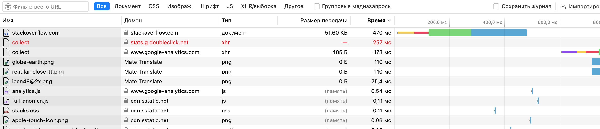
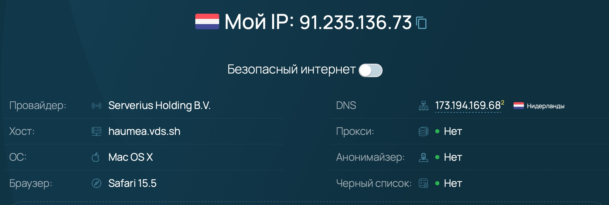

# Домашнее задание к занятию "3.6. Компьютерные сети, лекция 1"

1. Работа c HTTP через телнет.

- Подключитесь утилитой телнет к сайту stackoverflow.com `telnet stackoverflow.com 80`
- отправьте HTTP запрос

```
GET /questions HTTP/1.0
HOST: stackoverflow.com
[press enter]
[press enter]
```

- В ответе укажите полученный HTTP код, что он означает?

**Ответ:**

```bash
HTTP/1.1 301 Moved Permanently
cache-control: no-cache, no-store, must-revalidate
location: https://stackoverflow.com/questions
x-request-guid: 902dfdc5-1ff5-44cd-81e0-c6a96ce95e04
feature-policy: microphone 'none'; speaker 'none'
content-security-policy: upgrade-insecure-requests; frame-ancestors 'self' https://stackexchange.com
Accept-Ranges: bytes
Date: Sun, 03 Jul 2022 08:37:15 GMT
Via: 1.1 varnish
Connection: close
X-Served-By: cache-fra19134-FRA
X-Cache: MISS
X-Cache-Hits: 0
X-Timer: S1656837435.940594,VS0,VE93
Vary: Fastly-SSL
X-DNS-Prefetch-Control: off
Set-Cookie: prov=54c8c907-3237-9aed-b7a2-b8d21c43a1dc; domain=.stackoverflow.com; expires=Fri, 01-Jan-2055 00:00:00 GMT; path=/; HttpOnly

Connection closed by foreign host.

```

Это стандартный код ответа HTTP  получаемый в ответ от сервера в ситуации, когда запрошенный ресурс был на постоянной основе перемещён в новое месторасположение, и указывающий на то, что текущие ссылки, использующие данный URL, должны быть обновлены. Адрес нового месторасположения ресурса указывается в поле Location получаемого в ответ заголовка пакета протокола HTTP

2. Повторите задание 1 в браузере, используя консоль разработчика F12.

- откройте вкладку `Network`
- отправьте запрос [http://stackoverflow.com](http://stackoverflow.com/)
- найдите первый ответ HTTP сервера, откройте вкладку `Headers`
- укажите в ответе полученный HTTP код.
- проверьте время загрузки страницы, какой запрос обрабатывался дольше всего?
- приложите скриншот консоли браузера в ответ.

**Ответ:**

```
:status: 200
Content-Type: text/html; charset=utf-8
Vary: Accept-Encoding,Fastly-SSL
Content-Security-Policy: upgrade-insecure-requests; frame-ancestors 'self' https://stackexchange.com
X-Frame-Options: SAMEORIGIN
Via: 1.1 varnish
Content-Encoding: gzip
Cache-Control: private
Date: Sun, 03 Jul 2022 08:51:53 GMT
X-DNS-Prefetch-Control: off
Accept-Ranges: bytes
x-cache-hits: 0
x-request-guid: aa7f10ef-2ec0-4db5-8dbf-3d77a953b744
feature-policy: microphone 'none'; speaker 'none'
Strict-Transport-Security: max-age=15552000
x-timer: S1656838313.794542,VS0,VE279
x-served-by: cache-fra19142-FRA
x-cache: MISS
```

Дольше всех обрабатывалась загрузка главной страницы:



3. Какой IP адрес у вас в интернете?

**Ответ:**



4. Какому провайдеру принадлежит ваш IP адрес? Какой автономной системе AS? Воспользуйтесь утилитой `whois`

**Ответ:**

Провайдер: InternetHosting-net

Автономная система: AS50673

```bash
vagrant@vagrant:~$ whois -h whois.ripe.net  91.235.136.73 | grep netname
netname:        InternetHosting-net

vagrant@vagrant:~$ whois -h whois.ripe.net  91.235.136.73 | grep AS[[:digit:]]
% Information related to '91.235.136.0/23AS50673'
origin:         AS50673

```

5. Через какие сети проходит пакет, отправленный с вашего компьютера на адрес 8.8.8.8? Через какие AS? Воспользуйтесь утилитой `traceroute`

**Ответ:**

```bash
vagrant@vagrant:~$ traceroute -An 8.8.8.8
traceroute to 8.8.8.8 (8.8.8.8), 30 hops max, 60 byte packets
 1  10.0.2.2 [*]  0.462 ms  0.660 ms  0.644 ms
 2  10.8.0.1 [*]  56.059 ms  56.238 ms  56.031 ms
 3  91.235.136.1 [AS50673]  56.212 ms * *
 4  185.8.179.18 [AS50673]  65.044 ms  65.033 ms  65.359 ms
 5  185.8.179.33 [AS50673]  56.671 ms  57.491 ms  57.469 ms
 6  74.125.119.118 [AS15169]  58.413 ms  62.217 ms  58.905 ms
 7  108.170.241.161 [AS15169]  58.998 ms 108.170.241.129 [AS15169]  58.395 ms 108.170.241.161 [AS15169]  59.037 ms
 8  172.253.71.199 [AS15169]  58.045 ms 142.251.225.135 [AS15169]  58.257 ms 209.85.250.123 [AS15169]  57.584 ms
 9  8.8.8.8 [AS15169]  58.527 ms  58.402 ms  57.948 ms

```


6. Повторите задание 5 в утилите `mtr`. На каком участке наибольшая задержка - delay?

**Ответ:**

```bash
Host                                                                                                                                  																						Loss%   Snt   Last   Avg  Best  Wrst StDev
 1. AS???    10.0.2.2                       0.0%    53    0.4   0.4   0.2   1.4   0.2
 2. AS???    10.8.0.1                       1.9%    53   58.2  58.0  52.4 115.6   8.8
 3. AS50673  91.235.136.1                   0.0%    53   55.8  63.3  52.5 211.3  21.4
 4. AS50673  185.8.179.18                   0.0%    53   53.8  59.8  53.7  69.3   3.4
 5. AS50673  185.8.179.33                   0.0%    52   56.1  60.2  54.3  72.3   3.7
 6. AS15169  74.125.119.118                 0.0%    52   63.7  60.7  55.2  72.3   3.7
 7. AS15169  108.170.241.129                0.0%    52   61.5  60.2  55.6  70.1   3.6
 8. AS15169  142.251.48.175                 0.0%    52   59.3  61.9  56.3  68.5   2.9
 9. AS15169  8.8.8.8                        1.9%    52   57.4  61.2  54.9  68.1   2.9

```

Задержка в данном случае больше всего в моменте перехода из одной автономной системы в другую (63.7). 

7. Какие DNS сервера отвечают за доменное имя dns.google? Какие A записи? воспользуйтесь утилитой `dig`

**Ответ:**

DNS - сервера (лишние строки убрал)

```bash
vagrant@vagrant:~$ dig ns dns.google | grep ns.*
; <<>> DiG 9.16.1-Ubuntu <<>> ns dns.google
;; global options: +cmd
;; Got answer:
;dns.google.			IN	NS
dns.google.		5921	IN	NS	ns3.zdns.google.
dns.google.		5921	IN	NS	ns1.zdns.google.
dns.google.		5921	IN	NS	ns4.zdns.google.
dns.google.		5921	IN	NS	ns2.zdns.google.
```

A - записи (лишние строки убрал)

```bash
vagrant@vagrant:~$ dig A dns.google | grep [[:space:]]A[[:space:]]
; <<>> DiG 9.16.1-Ubuntu <<>> A dns.google
dns.google.		202	IN	A	8.8.8.8
dns.google.		202	IN	A	8.8.4.4
```

8. Проверьте PTR записи для IP адресов из задания 7. Какое доменное имя привязано к IP? воспользуйтесь утилитой `dig`

**Ответ:**

```bash
vagrant@vagrant:~$ dig -x 8.8.4.4 | grep "ANSWER SECTION" -A 1;dig -x 8.8.8.8 | grep "ANSWER SECTION" -A 1
;; ANSWER SECTION:
4.4.8.8.in-addr.arpa.	6963	IN	PTR	dns.google.
;; ANSWER SECTION:
8.8.8.8.in-addr.arpa.	6527	IN	PTR	dns.google.

```


В качестве ответов на вопросы можно приложите лог выполнения команд в консоли или скриншот полученных результатов.
