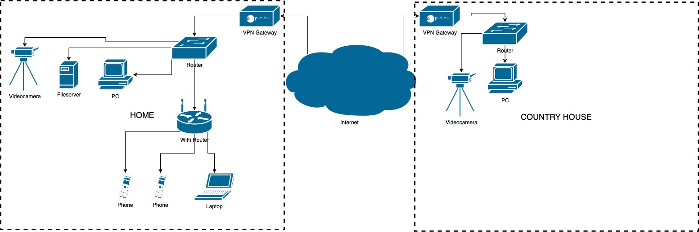

# Домашнее задание к занятию "3.8. Компьютерные сети, лекция 3"

1. Подключитесь к публичному маршрутизатору в интернет. Найдите маршрут к вашему публичному IP

```
telnet route-views.routeviews.org
Username: rviews
show ip route x.x.x.x/32
show bgp x.x.x.x/32
```

**Ответ:**

```bash
route-views>show ip route 31.172.193.134                
Routing entry for 31.172.193.0/24
  Known via "bgp 6447", distance 20, metric 0
  Tag 6939, type external
  Last update from 64.71.137.241 2w4d ago
  Routing Descriptor Blocks:
  * 64.71.137.241, from 64.71.137.241, 2w4d ago
      Route metric is 0, traffic share count is 1
      AS Hops 2
      Route tag 6939
      MPLS label: none
```

```bash
route-views>show bgp 31.172.193.134     
BGP routing table entry for 31.172.193.0/24, version 2328205388
Paths: (23 available, best #16, table default)
  Not advertised to any peer
  Refresh Epoch 1
  4901 6079 3356 12389
    162.250.137.254 from 162.250.137.254 (162.250.137.254)
      Origin IGP, localpref 100, valid, external
      Community: 65000:10100 65000:10300 65000:10400
      path 7FE0D9493830 RPKI State valid
      rx pathid: 0, tx pathid: 0
  Refresh Epoch 1
  7018 3356 12389
    12.0.1.63 from 12.0.1.63 (12.0.1.63)
      Origin IGP, localpref 100, valid, external
      Community: 7018:5000 7018:37232
      path 7FE0010B1738 RPKI State valid
      rx pathid: 0, tx pathid: 0
  Refresh Epoch 1
  3267 3356 12389
    194.85.40.15 from 194.85.40.15 (185.141.126.1)
      Origin IGP, metric 0, localpref 100, valid, external
      path 7FE006C1FEC8 RPKI State valid
      rx pathid: 0, tx pathid: 0
  Refresh Epoch 1
  20912 3257 3356 12389
    212.66.96.126 from 212.66.96.126 (212.66.96.126)
      Origin IGP, localpref 100, valid, external
      Community: 3257:8070 3257:30515 3257:50001 3257:53900 3257:53902 20912:65004
      path 7FE12897A608 RPKI State valid
      rx pathid: 0, tx pathid: 0
  Refresh Epoch 1
  1351 6939 12389
    132.198.255.253 from 132.198.255.253 (132.198.255.253)
      Origin IGP, localpref 100, valid, external
      path 7FE0450B4FF0 RPKI State valid
      rx pathid: 0, tx pathid: 0
  Refresh Epoch 1
  3333 1103 12389
    193.0.0.56 from 193.0.0.56 (193.0.0.56)
      Origin incomplete, localpref 100, valid, external
      path 7FE141D91368 RPKI State valid
      rx pathid: 0, tx pathid: 0
  Refresh Epoch 1
  101 3356 12389
    209.124.176.223 from 209.124.176.223 (209.124.176.223)
      Origin IGP, localpref 100, valid, external
      Community: 101:20100 101:20110 101:22100 3356:2 3356:22 3356:100 3356:123 3356:501 3356:901 3356:2065
      Extended Community: RT:101:22100
      path 7FE02A33EE68 RPKI State valid
      rx pathid: 0, tx pathid: 0
  Refresh Epoch 1
  49788 12552 12389
    91.218.184.60 from 91.218.184.60 (91.218.184.60)
      Origin incomplete, localpref 100, valid, external
      Community: 12552:12000 12552:12100 12552:12101 12552:22000
      Extended Community: 0x43:100:1
      path 7FE1259EC3E0 RPKI State valid
      rx pathid: 0, tx pathid: 0
  Refresh Epoch 1
  852 3356 12389
    154.11.12.212 from 154.11.12.212 (96.1.209.43)
      Origin IGP, metric 0, localpref 100, valid, external
      path 7FE0B36A5330 RPKI State valid
      rx pathid: 0, tx pathid: 0
  Refresh Epoch 1
  8283 1299 12389
    94.142.247.3 from 94.142.247.3 (94.142.247.3)
      Origin incomplete, metric 0, localpref 100, valid, external
      Community: 1299:30000 8283:1 8283:101 8283:102
      unknown transitive attribute: flag 0xE0 type 0x20 length 0x24
        value 0000 205B 0000 0000 0000 0001 0000 205B
              0000 0005 0000 0001 0000 205B 0000 0005
              0000 0002 
      path 7FE175068490 RPKI State valid
      rx pathid: 0, tx pathid: 0
  Refresh Epoch 1
  57866 3356 12389
    37.139.139.17 from 37.139.139.17 (37.139.139.17)
      Origin IGP, metric 0, localpref 100, valid, external
      Community: 3356:2 3356:22 3356:100 3356:123 3356:501 3356:901 3356:2065
      path 7FE111BF2038 RPKI State valid
      rx pathid: 0, tx pathid: 0
  Refresh Epoch 1
  3549 3356 12389
    208.51.134.254 from 208.51.134.254 (67.16.168.191)
      Origin IGP, metric 0, localpref 100, valid, external
      Community: 3356:2 3356:22 3356:100 3356:123 3356:501 3356:901 3356:2065 3549:2581 3549:30840
      path 7FE0BD718EF8 RPKI State valid
      rx pathid: 0, tx pathid: 0
  Refresh Epoch 1
  20130 6939 12389
    140.192.8.16 from 140.192.8.16 (140.192.8.16)
      Origin IGP, localpref 100, valid, external
      path 7FE0B1F08A70 RPKI State valid
      rx pathid: 0, tx pathid: 0
  Refresh Epoch 1
  3356 12389
    4.68.4.46 from 4.68.4.46 (4.69.184.201)
      Origin IGP, metric 0, localpref 100, valid, external
      Community: 3356:2 3356:22 3356:100 3356:123 3356:501 3356:901 3356:2065
      path 7FE0217A17C8 RPKI State valid
      rx pathid: 0, tx pathid: 0
  Refresh Epoch 1
  53767 174 12389
    162.251.163.2 from 162.251.163.2 (162.251.162.3)
      Origin incomplete, localpref 100, valid, external
      Community: 174:21101 174:22005 53767:5000
      path 7FE139AA2838 RPKI State valid
      rx pathid: 0, tx pathid: 0
  Refresh Epoch 1
  6939 12389
    64.71.137.241 from 64.71.137.241 (216.218.252.164)
      Origin IGP, localpref 100, valid, external, best
      path 7FE15587AB90 RPKI State valid
      rx pathid: 0, tx pathid: 0x0
  Refresh Epoch 1
  701 1273 12389
    137.39.3.55 from 137.39.3.55 (137.39.3.55)
      Origin incomplete, localpref 100, valid, external
      path 7FE0EAF8D588 RPKI State valid
      rx pathid: 0, tx pathid: 0
  Refresh Epoch 1
  7660 2516 12389
    203.181.248.168 from 203.181.248.168 (203.181.248.168)
      Origin incomplete, localpref 100, valid, external
      Community: 2516:1050 7660:9001
      path 7FE0DD1878C8 RPKI State valid
      rx pathid: 0, tx pathid: 0
  Refresh Epoch 1
  3561 3910 3356 12389
    206.24.210.80 from 206.24.210.80 (206.24.210.80)
      Origin IGP, localpref 100, valid, external
      path 7FE03A2DFFC0 RPKI State valid
      rx pathid: 0, tx pathid: 0
  Refresh Epoch 1
  3303 12389
    217.192.89.50 from 217.192.89.50 (138.187.128.158)
      Origin incomplete, localpref 100, valid, external
      Community: 3303:1004 3303:1006 3303:1030 3303:3056
      path 7FE02AC23168 RPKI State valid
      rx pathid: 0, tx pathid: 0
  Refresh Epoch 3
  2497 12389
    202.232.0.2 from 202.232.0.2 (58.138.96.254)
      Origin incomplete, localpref 100, valid, external
      path 7FE08525C248 RPKI State valid
      rx pathid: 0, tx pathid: 0
  Refresh Epoch 1
  1221 4637 3356 12389
    203.62.252.83 from 203.62.252.83 (203.62.252.83)
      Origin IGP, localpref 100, valid, external
      path 7FE17602FAC8 RPKI State valid
      rx pathid: 0, tx pathid: 0
  Refresh Epoch 1
  3257 3356 12389
    89.149.178.10 from 89.149.178.10 (213.200.83.26)
      Origin IGP, metric 10, localpref 100, valid, external
      Community: 3257:8794 3257:30043 3257:50001 3257:54900 3257:54901
      path 7FE0D7DE2DF8 RPKI State valid
      rx pathid: 0, tx pathid: 0
```

2. Создайте dummy0 интерфейс в Ubuntu. Добавьте несколько статических маршрутов. Проверьте таблицу маршрутизации.

**Ответ:**

```bash
root@vagrant:/home/vagrant# ip link add dummy0 type dummy
root@vagrant:/home/vagrant# sudo ip addr add 10.0.2.62/24 dev dummy0
root@vagrant:/home/vagrant# sudo ip link set dummy0 up
root@vagrant:/home/vagrant# ip a

4: dummy0: <BROADCAST,NOARP,UP,LOWER_UP> mtu 1500 qdisc noqueue state UNKNOWN group default qlen 1000
    link/ether 62:fb:80:2f:c1:47 brd ff:ff:ff:ff:ff:ff
    inet 10.0.2.62/24 scope global dummy0
       valid_lft forever preferred_lft forever
    inet6 fe80::60fb:80ff:fe2f:c147/64 scope link 
       valid_lft forever preferred_lft forever

root@vagrant:/home/vagrant# ip route add 87.250.250.242 via 10.0.2.62
root@vagrant:/home/vagrant# ip route add 87.250.250.240 via 10.0.2.15
root@vagrant:/home/vagrant# ip route
default via 10.0.2.2 dev eth0 proto dhcp src 10.0.2.15 metric 100 
10.0.2.0/24 dev eth0 proto kernel scope link src 10.0.2.15 
10.0.2.0/24 dev dummy0 proto kernel scope link src 10.0.2.62 
10.0.2.2 dev eth0 proto dhcp scope link src 10.0.2.15 metric 100 
87.250.250.240 via 10.0.2.15 dev eth0 
87.250.250.242 via 10.0.2.62 dev dummy0 

```


3. Проверьте открытые TCP порты в Ubuntu, какие протоколы и приложения используют эти порты? Приведите несколько примеров.

**Ответ:**

```bash
root@vagrant:/home/vagrant# netstat -plnt 
Active Internet connections (only servers)
Proto Recv-Q Send-Q Local Address           Foreign Address         State       PID/Program name    
tcp        0      0 127.0.0.53:53           0.0.0.0:*               LISTEN      656/systemd-resolve 
tcp        0      0 0.0.0.0:22              0.0.0.0:*               LISTEN      1005/sshd: /usr/sbi 
tcp6       0      0 :::22                   :::*                    LISTEN      1005/sshd: /usr/sbi 
```

53 - использует systemd-resolved. Выполняет разрешение сетевых имен для локальных приложений. Может использоваться для DNS.

22 - работа сервера ssh. Кстати наткнулся на интересную статью, почему именно 22 порт был использован для SSH: [Статья на хабре](https://habr.com/ru/post/418533/)

4. Проверьте используемые UDP сокеты в Ubuntu, какие протоколы и приложения используют эти порты?

**Ответ:**

```bash
root@vagrant:/home/vagrant# netstat -plnu 
Active Internet connections (only servers)
Proto Recv-Q Send-Q Local Address           Foreign Address         State       PID/Program name    
udp        0      0 127.0.0.53:53           0.0.0.0:*                           656/systemd-resolve 
udp        0      0 10.0.2.15:68            0.0.0.0:*                           653/systemd-network 
```


53 - то же, что и в предыдущем пункте.

68 - используется службой systemd-network. Протокол DHCP использует данный порт.

5. Используя diagrams.net, создайте L3 диаграмму вашей домашней сети или любой другой сети, с которой вы работали.



