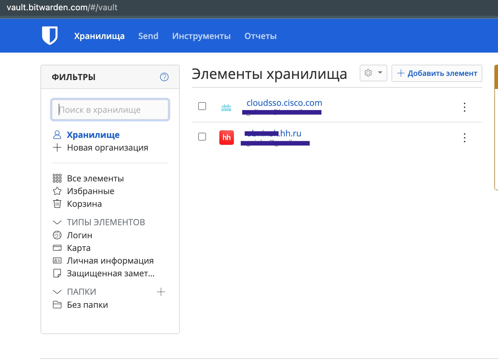
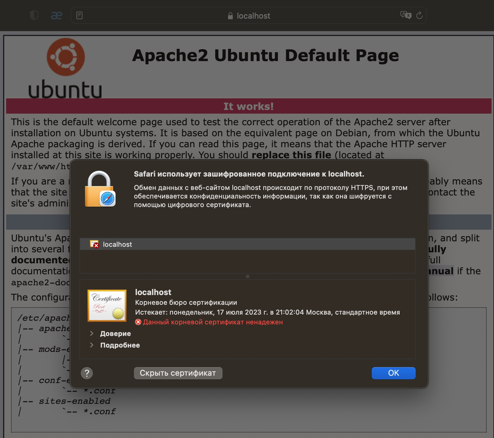
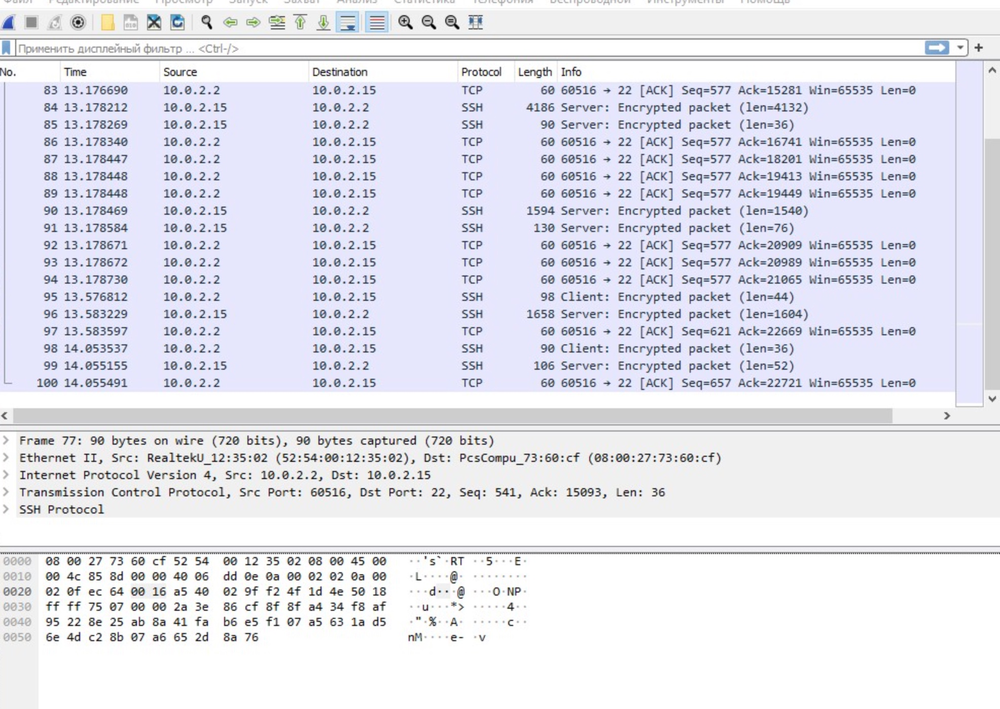

# Домашнее задание к занятию "3.9. Элементы безопасности информационных систем"

1. Установите Bitwarden плагин для браузера. Зарегестрируйтесь и сохраните несколько паролей.

   **Ответ:**

   

2. Установите Google authenticator на мобильный телефон. Настройте вход в Bitwarden акаунт через Google authenticator OTP.

   **Ответ:**

   

3. Установите apache2, сгенерируйте самоподписанный сертификат, настройте тестовый сайт для работы по HTTPS.

   ```bash
   vagrant@vagrant:~$ sudo systemctl status apache2
   ● apache2.service - The Apache HTTP Server
        Loaded: loaded (/lib/systemd/system/apache2.service; enabled; vendor prese>
        Active: active (running) since Sun 2022-07-17 17:52:19 UTC; 49s ago
          Docs: https://httpd.apache.org/docs/2.4/
      Main PID: 3377 (apache2)
         Tasks: 55 (limit: 1071)
        Memory: 6.0M
        CGroup: /system.slice/apache2.service
                ├─3377 /usr/sbin/apache2 -k start
                ├─3379 /usr/sbin/apache2 -k start
                └─3380 /usr/sbin/apache2 -k start
   
   Jul 17 17:52:19 vagrant systemd[1]: Starting The Apache HTTP Server...
   Jul 17 17:52:19 vagrant apachectl[3376]: AH00558: apache2: Could not reliably d>
   Jul 17 17:52:19 vagrant systemd[1]: Started The Apache HTTP Server.
   
   vagrant@vagrant:~$ sudo a2enmod ssl
   Considering dependency setenvif for ssl:
   Module setenvif already enabled
   Considering dependency mime for ssl:
   Module mime already enabled
   Considering dependency socache_shmcb for ssl:
   Enabling module socache_shmcb.
   Enabling module ssl.
   See /usr/share/doc/apache2/README.Debian.gz on how to configure SSL and create self-signed certificates.
   To activate the new configuration, you need to run:
     systemctl restart apache2
   
   
   vagrant@vagrant:~$ sudo systemctl restart apache2
   vagrant@vagrant:~$ sudo openssl req -x509 -nodes -days 365 \
   > -newkey rsa:2048 -keyout /etc/ssl/private/apache-selfsigned.key \
   > -out /etc/ssl/certs/apache-selfsigned.crt
   Generating a RSA private key
   .+++++
   .......................................................................................................+++++
   writing new private key to '/etc/ssl/private/apache-selfsigned.key'
   -----
   You are about to be asked to enter information that will be incorporated
   into your certificate request.
   What you are about to enter is what is called a Distinguished Name or a DN.
   There are quite a few fields but you can leave some blank
   For some fields there will be a default value,
   If you enter '.', the field will be left blank.
   -----
   Country Name (2 letter code) [AU]:RU
   State or Province Name (full name) [Some-State]:
   Locality Name (eg, city) []:
   Organization Name (eg, company) [Internet Widgits Pty Ltd]:
   Organizational Unit Name (eg, section) []:
   Common Name (e.g. server FQDN or YOUR name) []:localhost
   Email Address []:
   
   
   vagrant@vagrant:~$ sudo nano /etc/apache2/sites-available/000-default.conf 
   
   <VirtualHost *:443>
      ServerName localhost
      DocumentRoot /var/www/html
   
      SSLEngine on
      SSLCertificateFile /etc/ssl/certs/apache-selfsigned.crt
      SSLCertificateKeyFile /etc/ssl/private/apache-selfsigned.key
   </VirtualHost>
   <VirtualHost *:80>
   
           ServerAdmin webmaster@localhost
           DocumentRoot /var/www/html
   
           ErrorLog ${APACHE_LOG_DIR}/error.log
           CustomLog ${APACHE_LOG_DIR}/access.log combined
   
   </VirtualHost>
   
   vagrant@vagrant:~$ sudo systemctl restart apache2
   ```

   

4. Проверьте на TLS уязвимости произвольный сайт в интернете (кроме сайтов МВД, ФСБ, МинОбр, НацБанк, РосКосмос, РосАтом, РосНАНО и любых госкомпаний, объектов КИИ, ВПК ... и тому подобное).

   **Ответ:**

   ```bash
   vagrant@vagrant:~/testssl.sh$ ./testssl.sh -e --fast --parallel https://www.habr.ru/
   
   ###########################################################
       testssl.sh       3.1dev from https://testssl.sh/dev/
       (88e80d2 2022-07-02 22:13:06)
   
         This program is free software. Distribution and
                modification under GPLv2 permitted.
         USAGE w/o ANY WARRANTY. USE IT AT YOUR OWN RISK!
   
          Please file bugs @ https://testssl.sh/bugs/
   
   ###########################################################
   
    Using "OpenSSL 1.0.2-chacha (1.0.2k-dev)" [~183 ciphers]
    on vagrant:./bin/openssl.Linux.x86_64
    (built: "Jan 18 17:12:17 2019", platform: "linux-x86_64")
   
   
    Start 2022-07-17 18:32:13        -->> 178.248.233.33:443 (www.habr.ru) <<--
   
    rDNS (178.248.233.33):  habr.com.
    Service detected:       HTTP
   
   
   
    Testing all 183 locally available ciphers against the server, ordered by encryption strength 
   
   
   Hexcode  Cipher Suite Name (OpenSSL)       KeyExch.   Encryption  Bits     Cipher Suite Name (IANA/RFC)
   -----------------------------------------------------------------------------------------------------------------------------
    xc030   ECDHE-RSA-AES256-GCM-SHA384       ECDH 256   AESGCM      256      TLS_ECDHE_RSA_WITH_AES_256_GCM_SHA384              
    xc02c   ECDHE-ECDSA-AES256-GCM-SHA384     ECDH 256   AESGCM      256      TLS_ECDHE_ECDSA_WITH_AES_256_GCM_SHA384            
    xc02f   ECDHE-RSA-AES128-GCM-SHA256       ECDH 256   AESGCM      128      TLS_ECDHE_RSA_WITH_AES_128_GCM_SHA256              
    xc02b   ECDHE-ECDSA-AES128-GCM-SHA256     ECDH 256   AESGCM      128      TLS_ECDHE_ECDSA_WITH_AES_128_GCM_SHA256            
    xc027   ECDHE-RSA-AES128-SHA256           ECDH 256   AES         128      TLS_ECDHE_RSA_WITH_AES_128_CBC_SHA256              
    xc023   ECDHE-ECDSA-AES128-SHA256         ECDH 256   AES         128      TLS_ECDHE_ECDSA_WITH_AES_128_CBC_SHA256            
    xc013   ECDHE-RSA-AES128-SHA              ECDH 256   AES         128      TLS_ECDHE_RSA_WITH_AES_128_CBC_SHA                 
    xc009   ECDHE-ECDSA-AES128-SHA            ECDH 256   AES         128      TLS_ECDHE_ECDSA_WITH_AES_128_CBC_SHA               
    x9c     AES128-GCM-SHA256                 RSA        AESGCM      128      TLS_RSA_WITH_AES_128_GCM_SHA256                    
    x3c     AES128-SHA256                     RSA        AES         128      TLS_RSA_WITH_AES_128_CBC_SHA256                    
    x2f     AES128-SHA                        RSA        AES         128      TLS_RSA_WITH_AES_128_CBC_SHA                       
    x0a     DES-CBC3-SHA                      RSA        3DES        168      TLS_RSA_WITH_3DES_EDE_CBC_SHA                      
   
   
    Done 2022-07-17 18:32:18 [   7s] -->> 178.248.233.33:443 (www.habr.ru) <<--
   ```

5. Установите на Ubuntu ssh сервер, сгенерируйте новый приватный ключ. Скопируйте свой публичный ключ на другой сервер. Подключитесь к серверу по SSH-ключу.

   **Ответ:**

   ```bash
   vagrant@vagrant:~$ systemctl status sshd.service
   ● ssh.service - OpenBSD Secure Shell server
        Loaded: loaded (/lib/systemd/system/ssh.service; enabled; vendor preset: enabled)
        Active: active (running) since Sun 2022-07-17 17:42:33 UTC; 51min ago
          Docs: man:sshd(8)
                man:sshd_config(5)
      Main PID: 797 (sshd)
         Tasks: 1 (limit: 1071)
        Memory: 5.2M
        CGroup: /system.slice/ssh.service
                └─797 sshd: /usr/sbin/sshd -D [listener] 0 of 10-100 startups
   
   Jul 17 17:42:32 vagrant sshd[797]: Server listening on 0.0.0.0 port 22.
   Jul 17 17:42:32 vagrant sshd[797]: Server listening on :: port 22.
   Jul 17 17:42:33 vagrant systemd[1]: Started OpenBSD Secure Shell server.
   Jul 17 17:42:33 vagrant sshd[799]: Accepted publickey for vagrant from 10.0.2.2 port 5005>
   Jul 17 17:42:33 vagrant sshd[799]: pam_unix(sshd:session): session opened for user vagran>
   Jul 17 17:42:35 vagrant sshd[1192]: Accepted publickey for vagrant from 10.0.2.2 port 500>
   Jul 17 17:42:35 vagrant sshd[1192]: pam_unix(sshd:session): session opened for user vagra>
   Jul 17 17:42:37 vagrant sshd[1353]: ssh_dispatch_run_fatal: Connection from 10.0.2.2 port>
   Jul 17 17:42:46 vagrant sshd[1358]: Accepted publickey for vagrant from 10.0.2.2 port 500>
   Jul 17 17:42:46 vagrant sshd[1358]: pam_unix(sshd:session): session opened for user vagra>
   
   vagrant@vagrant:~$ ssh-keygen
   Generating public/private rsa key pair.
   Enter file in which to save the key (/home/vagrant/.ssh/id_rsa): 
   Enter passphrase (empty for no passphrase): 
   Enter same passphrase again: 
   Your identification has been saved in /home/vagrant/.ssh/id_rsa
   Your public key has been saved in /home/vagrant/.ssh/id_rsa.pub
   The key fingerprint is:
   SHA256:t6zHNuV8Au31a9krTbOTNBU7qGWo6Zqr6yLF8jU3uHM vagrant@vagrant
   The key's randomart image is:
   +---[RSA 3072]----+
   |                 |
   |               . |
   |            . . o|
   |           . + o.|
   |  .   . S +.+   o|
   | . o + o =.oo .= |
   |  + . + o.o* .+.B|
   | . o o E.o= =..Bo|
   |  . o+=++o . ooo+|
   +----[SHA256]-----+
   vagrant@vagrant:~$ ssh-copy-id vagrant@localhost
   /usr/bin/ssh-copy-id: INFO: Source of key(s) to be installed: "/home/vagrant/.ssh/id_rsa.pub"
   The authenticity of host 'localhost (127.0.0.1)' can't be established.
   ECDSA key fingerprint is SHA256:RztZ38lZsUpiN3mQrXHa6qtsUgsttBXWJibL2nAiwdQ.
   Are you sure you want to continue connecting (yes/no/[fingerprint])? yes
   /usr/bin/ssh-copy-id: INFO: attempting to log in with the new key(s), to filter out any that are already installed
   /usr/bin/ssh-copy-id: INFO: 1 key(s) remain to be installed -- if you are prompted now it is to install the new keys
   vagrant@localhost's password: 
   Permission denied, please try again.
   vagrant@localhost's password: 
   
   Number of key(s) added: 1
   
   Now try logging into the machine, with:   "ssh 'vagrant@localhost'"
   and check to make sure that only the key(s) you wanted were added.
   
   vagrant@vagrant:~$ ssh 'vagrant@localhost'
   Enter passphrase for key '/home/vagrant/.ssh/id_rsa': 
   Welcome to Ubuntu 20.04.3 LTS (GNU/Linux 5.4.0-91-generic x86_64)
   
    * Documentation:  https://help.ubuntu.com
    * Management:     https://landscape.canonical.com
    * Support:        https://ubuntu.com/advantage
   
     System information as of Sun 17 Jul 2022 06:48:39 PM UTC
   
     System load:  0.01               Processes:             133
     Usage of /:   12.1% of 30.88GB   Users logged in:       1
     Memory usage: 23%                IPv4 address for eth0: 10.0.2.15
     Swap usage:   0%
   
   
   This system is built by the Bento project by Chef Software
   More information can be found at https://github.com/chef/bento
   Last login: Sun Jul 17 17:42:46 2022 from 10.0.2.2
   ```

6. Переименуйте файлы ключей из задания 5. Настройте файл конфигурации SSH клиента, так чтобы вход на удаленный сервер осуществлялся по имени сервера.

   **Ответ:**

   ```bash
   
   vagrant@vagrant:~$ mv /home/vagrant/.ssh/id_rsa /home/vagrant/.ssh/vagrant_rsa
   vagrant@vagrant:~$ touch ~/.ssh/config && chmod 600 ~/.ssh/config
   vagrant@vagrant:~$ sudo nano .ssh/config
   
   Host vagrant
        HostName localhost
        User vagrant
        IdentityFile ~/.ssh/vagrant_rsa
   
   vagrant@vagrant:~$ ssh vagrant
   Enter passphrase for key '/home/vagrant/.ssh/vagrant_rsa': 
   Welcome to Ubuntu 20.04.3 LTS (GNU/Linux 5.4.0-91-generic x86_64)
   
    * Documentation:  https://help.ubuntu.com
    * Management:     https://landscape.canonical.com
    * Support:        https://ubuntu.com/advantage
   
     System information as of Sun 17 Jul 2022 06:52:19 PM UTC
   
     System load:  0.0                Processes:             137
     Usage of /:   12.1% of 30.88GB   Users logged in:       1
     Memory usage: 24%                IPv4 address for eth0: 10.0.2.15
     Swap usage:   0%
   
   
   This system is built by the Bento project by Chef Software
   More information can be found at https://github.com/chef/bento
   Last login: Sun Jul 17 18:48:39 2022 from 127.0.0.1
   ```

   

7. Соберите дамп трафика утилитой tcpdump в формате pcap, 100 пакетов. Откройте файл pcap в Wireshark.

   **Ответ:**

   ```bash
   sudo tcpdump -c 100 -w vag.cap
   ```

   